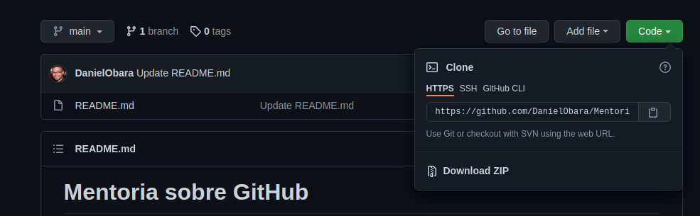
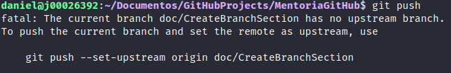
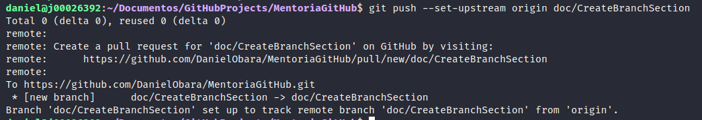
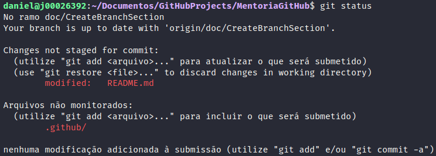

<h1 align="center">
    
</h1>

<p align="center">

  
	
  <a href="https://www.linkedin.com/in/danielobara/">
    
  </a>

  <a href="https://github.com/DanielObara/MentoriaGitHub/commits/main">
    
  </a>


  
   <a href="https://github.com/DanielObara/MentoriaGitHub/stargazers">
    
  </a>
</p>

## Resumidão (do clone ao push)
Se você já sabe executar todo o fluxo e só quer relembrar, deixo abaixo o fluxo (básico e sem criação de branch) resumido mas se voce quiser saber detalhadamente recomendo prosseguir a leitura.

```bash
# Clone o repositório
$ git clone https://github.com/DanielObara/MentoriaGitHub
# Modifique algo e adicione ao stage
$ git add .
# Commite com a mensagem do que fez, siga o commitlint!
$ git commit -m "feat(lang): add portuguese language"
# Suba suas alterações
$ git push
```

## Criando um novo repositório:
Crie uma nova pasta, abra-a e no terminal execute o comando

```bash
$ git init
```
## Clonando um repositório:
Crie uma cópia de trabalho em um repositório local executando o comando:

```bash
$ git clone /caminho/para/o/repositório
```
Quando usar um servidor remoto, por exemplo o GitHub, seu comando será:

```bash
$ git clone https://github.com/DanielObara/MentoriaGitHub
```
O endereço do servidor remoto (repositório) o endereço (link) você pode obter clicando no botão code na página do repositório. 

Exemplo abaixo:

<p align="center">
  </img>
</p>

Para acessar o projeto recém clonado, acesse a pasta do projeto e caso tenha acessado via terminal digite:

```bash 
$ code .
```
Caso não seja via terminal clique com o botão direito dentro da pasta e veja se tem a opção de abrir no VSCode.

## Atualizando o repositório remoto:

Seus repositórios locais consistem em três "árvores" mantidas pelo git. A primeira delas é sua Working Directory que contém os arquivos atuais, a segunda Index / Stage que funciona como uma área temporária e finalmente a HEAD que aponta para o último commit (confirmação) que você fez.

<p align="center">
  </img>
</p>

## Adicionar & Confirmar

Você pode propor mudanças (adicioná-las ao Index) usando:
Para adicionar um arquivo em particular

```bash
$ git add caminho/até/o/arquivo
```
ou para adicionar todas as alterações:

```bash
$ git add .

# ou pode-se usar *

$ git add *
```
Este é o primeiro passo no fluxo de atualizar o repositorio de forma básica do git. 

Para realmente confirmar estas mudanças (isto é, fazer um commit), use:

```bash
$ git commit -m "Mensagem dizendo o que eu fiz nessas alterações"
```
**Obs: recomendo seguir a convenção de commit conhecida como conventional changelog ou [commitlint](https://github.com/conventional-changelog/commitlint)

Agora o arquivo é enviado para o HEAD, mas ainda não foi enviado para o repositório remoto (aquele lá nos servidores/nuvem do Github).

## Enviando as alterações:
Lembre-se que suas alterações agora estão no HEAD da sua cópia do repositório local. 
Para enviar estas alterações ao seu repositório remoto, execute

```bash
$ git push origin main
```

Altere main para qualquer ramo (branch) desejado, enviando suas alterações para branch específica. Caso não especifique qual branch, o git entenderá por padrão a branch atual que você estiver.

Se você não clonou de um repositório que já existe e quer conectar seu repositório a um no servidor remoto (GitHub por exemplo), você deve adicioná-lo com

```bash
$ git remote add origin <servidor>
```

Ficaria assim:
  
```bash
$ git remote add origin git@github.com:DanielObara/MentoriaGitHub.git
```

Agora você é capaz de enviar suas alterações para o servidor remoto selecionado.

## Criando o branch

Branches ("ramos") são utilizados para desenvolver funcionalidades isoladas umas das outras. O branch main é o branch "padrão" quando você cria um repositório. Use outros branches para desenvolver e junte-os (merge) ao branch main após a conclusão.

Por questão de padrão de nomenclatura costumo nomear as branchs com prefixo do que ela significa. Por exemplo:

- bugfix/
 <p>Branch de um bug que necessita ser corrigido.</p>

- feature/
<p>Uma nova feature que será adicionada ao projeto.</p>

- refactor/
<p>Quando precisamos fazer uma melhoria em algum trecho do código</p>

- doc/
<p>Quando fazemos alguma alteração ou criação de documentações</p>

Crie um novo branch chamado "feature/Navbar" e selecione-o usando:
  
```bash
$ git checkout -b doc/CreateBranchSection
```
retorne para o main usando
  
```bash
$ git checkout main
```

e remova o branch da seguinte forma
  
```bash
$ git branch -d doc/CreateBranchSection
```

Um branch não está disponível aos outros a menos que você envie o branch para seu repositório remoto.

Ao tentar efetuar o push, receberá a seguinte mensagem no terminal:

<p align="center">
  </img>
</p>

```bash
$ git push --set-upstream origin doc/CreateBranchSection
```
Após isso a branch será enviada ao repositório remoto e você obterá a seguinte resposta em seu terminal:

<p align="center">
   doc/CreateBranchSection
Branch 'doc/CreateBranchSection' set up to track remote branch 'doc/CreateBranchSection' from 'origin'."></img>
</p>

## Qual a situação atual (git status)?
Para verificar o que foi feito e qual a situação (Se está atualizado ou se tem modificações) execute o comando abaixo:

```bash
$ git status
```

Após executar git status você verá qual branch se encontra e quais as alterações e arquivos não monitorados pelo git.

<p align="center">
  ... para atualizar o que será submetido)
  (use git restore <file>... to discard changes in working directory)
        modified:   README.md
Arquivos não monitorados:
  (utilize git add <arquivo>... para incluir o que será submetido)
        .github/
nenhuma modificação adicionada à submissão (utilize git add e/ou git commit -a)"></img>
</p>

## Como contribuir com este repositório?

- Crie um fork;
- Crie um branch com suas features: `git checkout -b feature/my-feature`;
- Commit suas alterações: `git commit -m 'feat: My new feature'`;
- Faça um push com a sua branch `git push origin my-feature`;
- Crie um pull request no GitHub.

Após mergeado voce receberá a mensagem de que foi concluído e poderá deletar sua branch.


Made with ♥ by Daniel Obara :wave: [Get in touch!](https://www.linkedin.com/in/danielobara/)
